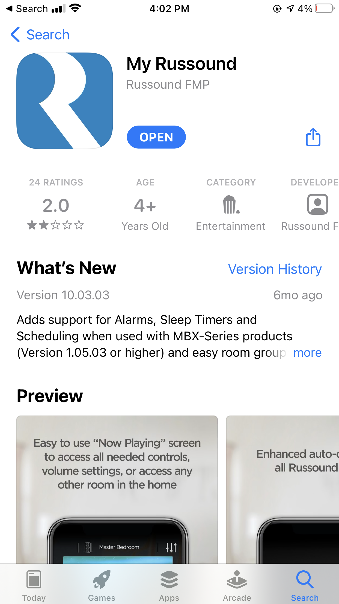

# Speaker System

## Parts

__1. Integra__ - Must be turned on for living room speakers to work  
__2. Sonance__ - Must be turned on for dock speakers to work  
__3. Digital Media Streamer (DMS)__ - Must be turned on to listen to anything except the radio.  Provides the capability to stream [Spotify](https://www.spotify.com/us/), [Pandora](https://www.pandora.com/), etc.  
__4. MCA Multizone Controller__ - Must be turned on for pretty much anything to work. It is the heart of the sound system and is linked with the iPad/iPhone app that controls all speakers (except the living room, but more on that later...)  
__5. crown CDi1000__ - Must be turned on for the pool speakers to work  

Going forward I will refer to each item by name.

## Initial Setup

The _Digial Media Streamer (DMS)_ and _MCA Multizone Controller_ need to be connected to the same wifi network as the device (ipad or iphone) controlling the speaker system.  That means we need to connect it to `60 W Rivo` network. 

In order to do this, I moved the wifi extender from outside the bedroom door to inside the master bedroom closet.  On the back of the wifi extender there are ethernet ports.  These were not being used before, as they are just an optional way to hardwire a device into the network.  But they come in handy here.

I found 2 ethernet cords, one gray and one yellow (the color does not matter outside of identification purposes), and plugged them into the back of the wifi extender.

  
  
  

I plugged the other end of the yellow cord into the ethernet port on the back of the _DMS_.

  

  
  
  

I also plugged the other end of the gray cord into the ethernet port on the back of the _MCA_.

  
  

## Usage

On your iphone, go to the app storer and download the "My Russound" app.

  
  

Make sure you are connected to wifi network. When you open the app, it should automatically find the speaker system and give you a list of available streaming apps to play music from such as Spotify.  From there, you can control the music from your phone, and which rooms' speakers are turned on.

